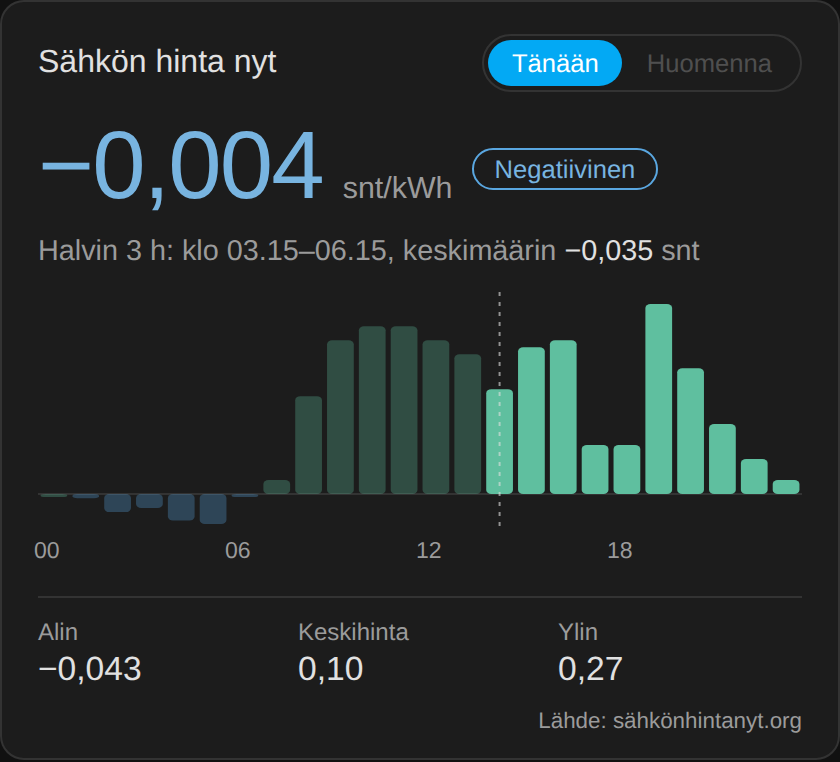

# ⚡ Sähkön hinta card

A Lovelace card for the Finnish spot electricity price (pörssisähkö) in Home Assistant.

[](https://my.home-assistant.io/redirect/hacs_repository/?owner=sahkonhintanyt-ha&repository=sahkon-hinta-card&category=plugin)



- Current price with price level (negative, cheap, normal, expensive, very expensive)
- Today's and tomorrow's prices as a bar chart; negative prices hang below the zero line
- Cheapest 3-hour window, and lowest / average / highest price of the day
- Hover or tap a bar to see the exact price
- Follows your Home Assistant theme (light and dark)

Right from the card (admin users):

- **Ilmoitus** – price alert to your phone or Home Assistant notifications
  (below / above a limit, or when tomorrow's prices are published)
- **Ohjaus** – run a device or a scene during the cheapest hours or below a price limit
- **Scene** – save the current state of chosen devices as a scene

Everything the card creates is a normal Home Assistant automation or scene (marked with ⚡).

## Requirements

The card reads `sensor.sahkon_hinta_nyt`. Install the free sensor package first:
**[sahkon-hinta-nyt-ha](https://github.com/sahkonhintanyt-ha/sahkon-hinta-nyt-ha)**
(no API key, uses Home Assistant's built-in REST integration).

Data: **[Sähkön hinta nyt – sähkönhintanyt.org](https://sähkönhintanyt.org/)**
(ENTSO-E / Nord Pool day-ahead, VAT 25.5 % included).

## Installation

### HACS (recommended)

1. Click the button above, or in HACS open ⋮ → **Custom repositories**, add
   `https://github.com/sahkonhintanyt-ha/sahkon-hinta-card` with type **Dashboard**.
2. Download **Sähkön hinta card** and refresh your browser.

### Manual

1. Copy `sahkon-hinta-card.js` to `config/www/`.
2. Settings → Dashboards → ⋮ → Resources → Add resource:
   `/local/sahkon-hinta-card.js`, type **JavaScript module**.

## Configuration

```yaml
type: custom:sahkon-hinta-card
entity: sensor.sahkon_hinta_nyt
# optional:
# name: Sähkön hinta nyt
# cheap_entity: binary_sensor.sahko_halpaa
# thresholds: [5, 10, 15]   # cheap / normal / expensive limits in snt/kWh
# show_actions: true        # Ilmoitus / Ohjaus / Scene buttons
# show_source: true
# time_zone: Europe/Helsinki # times are shown in Finnish time by default
```

## Suomeksi

Pörssisähkön hintakortti Home Assistantiin: hinta nyt, tämän päivän ja huomisen
hinnat pylväskaaviona, halvin kolmen tunnin jakso sekä hintailmoitukset,
laitteiden ohjaus halvimpina tunteina ja scenejen tallennus suoraan kortista.
Asenna ensin anturipaketti [sahkon-hinta-nyt-ha](https://github.com/sahkonhintanyt-ha/sahkon-hinta-nyt-ha).

## License

MIT
